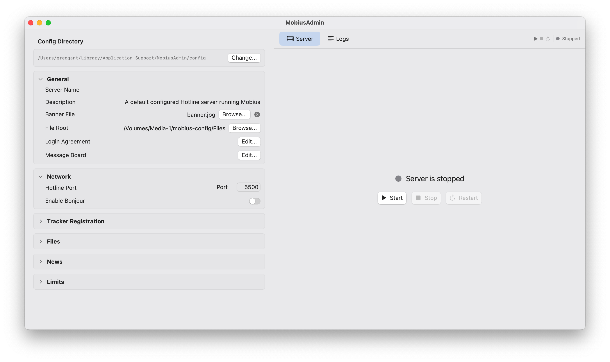

# MobiusAdmin - A Hotline Server with a GUI

A native macOS GUI for running a [Mobius](https://github.com/jhalter/mobius) Hotline server. Instead of fiddling with the command line, you get a point-and-click app that manages the server process, configuration, and logs.

Hotline was always designed to help the technically curious jump into the world of server creation with a simple point-and-click interface. The goal is to be able to provide this experience for Mobius, the most popular version of the Hotline server operating today. 

There will not be a Windows or Linux version of this as it is Swift UI build, aka Mac Native. 

The app embeds the Mobius Hotline server binary (written in Go) and wraps it in a SwiftUI interface. Being a mix of Go and Swift UI, this app should use minimal amounts of RAM to operate. It's 55~ MB size is largely due to needing dual UB binaries for the Mobius Go CLI and the Swift UI. 



## What is Hotline?

[Hotline](https://en.wikipedia.org/wiki/Hotline_Communications) was a client-server platform from the late '90s for file sharing, chat, and message boards. It has a small but active community keeping it alive. Mobius is a modern, cross-platform Hotline server that's compatible with all the popular Hotline clients.

## Features

- Start, stop, and restart the server with one click
- Edit server name, description, port, and tracker registration from the GUI
- Browse and set your file root directory
- Edit the login agreement and message board
- Set a server banner image
- **Account management** — create, edit, and delete user accounts with a visual permissions editor covering all 35 Hotline access flags
- **Ban management** — ban and unban by IP, username, or nickname via the server's REST API
- **Online users monitor** — see who's connected in real time with auto-refreshing stats (connected users, peak, downloads, uploads)
- **File browser** — browse the server's file root directory with file sizes and dates
- **News editor** — manage the message board and threaded news categories
- **Live log viewer** — combined command center view with online users and server logs in a split pane
- **Config reload** — push config changes to the running server without restarting
- Server process is automatically stopped when the app quits
- Universal binary (Apple Silicon and Intel)
- Fully signed and notarized for macOS Gatekeeper

## Future Plans

- First time setup with guided setup
- Chasing down whatever features Mobius has that haven't been implemented yet

## Installation

### Download

Grab the latest `.dmg` from the [Releases](https://github.com/jhalter/mobius/releases) page, open it, and drag MobiusAdmin to your Applications folder.

### Build from source

Requirements:
- Xcode 15+
- [XcodeGen](https://github.com/yonaskolb/XcodeGen) (`brew install xcodegen`)
- [Go](https://go.dev) (to build the server binary)

```bash
# Build the server binary
make server

# Build the app (debug)
make gui

# Build a signed release
make gui-release

# Build, notarize, and staple
make gui-notarize
```

For release and notarization builds, create a `.env` file in the repo root:

```
APPLE_ID=your@email.com
APPLE_PASSWORD=your-app-specific-password
APPLE_TEAM_ID=YOUR_TEAM_ID
APPLE_SIGNING_IDENTITY=Developer ID Application: Your Name (YOUR_TEAM_ID)
```
## Pre macOS 14 Support

Currently I'm using Go 1.26 supports macOS 12 (Monterey) as the minimum, and  some newer SwiftUI APIs (like the @Observable macro which requires macOS 14). If someone is so inclined, macOS 12 wouldn't require much work. If someone is willing to try their hand at Go 1.22 with a fork, this could be ported to as early as 10.15 Catalina.

## Configuration

On first launch the app creates a config directory at:

```
~/Library/Application Support/MobiusAdmin/config/
```

This contains the standard Mobius config layout:

```
config/
├── Agreement.txt       # Login agreement shown to connecting users
├── Files/              # Shared files directory
├── MessageBoard.txt    # Server message board
├── ThreadedNews.yaml   # Threaded news data
├── Users/              # User account files
│   ├── admin.yaml      # Default admin (password: admin)
│   └── guest.yaml      # Default guest (no password)
├── banner.jpg          # Server banner image
└── config.yaml         # Server settings
```

You can change the config directory and file root from the Settings panel in the app.

## Default Accounts

- **guest** — no password, can download files and chat
- **admin** — password `admin`, full access

Change the admin password from a Hotline client after your first login.

## Network

The server listens on port **5500** by default (file transfers on 5501). To allow connections from outside your LAN, you'll need to forward these ports on your router.

## Looking for a Hotline Client?

Check out [Hotline Navigator](https://github.com/fuzzywalrus/Hotline-Navigator), a modern Hotline client available for macOS, Windows, Linux, Android, iOS, and iPadOS.

## License

See [LICENSE.txt](LICENSE.txt).
